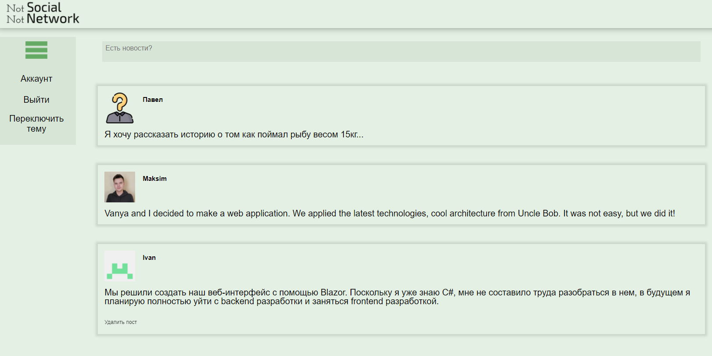
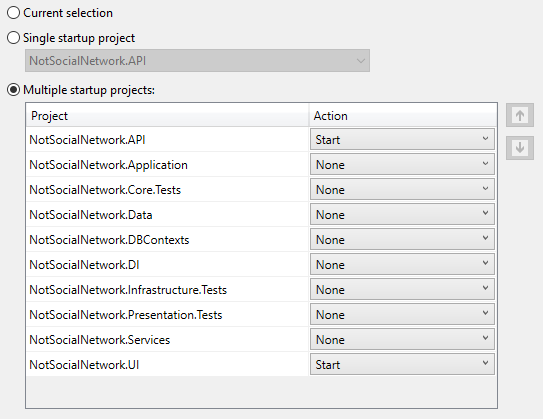
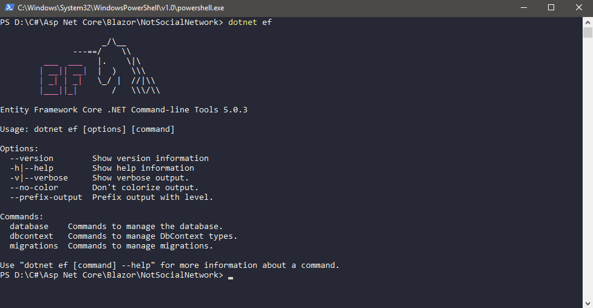

<div align="center">


</div>



> Description

## Table of contents
* [Architecture](#architecture)
* [Diagram](#diagram)
* [Projects](#projects)
* [Technologies](#technologies)
* [Versions](#versions)
* [How to start](#how-to-start)
* [Team](#team)
* [Status](#status)
* [Contacts](#contacts)

## Architecture


## Diagram


## Projects


## Technologies
* C# - v9.0
* .Net - v5.0
* EntityFrameworkCore - v5.0
* Web API - v5.0
* Blazor Server - v5.0
* Swagger - v5.6.3
* xUnit - v2.4.1
* Moq - v4.16.1

## Versions


## How to start


<details>
    <summary>Docker.</summary>

### Create certificate:
* Create certificate (Edit "YourPassword" to your password)
```
dotnet dev-certs https -ep $env:USERPROFILE\.aspnet\https\NotSocialNetwork.API.pfx -p YourPassword
```
* Set your certificate in secrets
```
dotnet user-secrets set "Kestrel:Certificates:Development:Password" "YourPassword" -p Src/Presentation/NotSocialNetwork.API/
```

### Run docker:
```
docker-compose build
docker-compose up
```

| Application 	    | URL |
|------------------ | -------------------------------------- |
| NotSocialNetwork.API  | https://localhost:5001/swagger/index.html |
| NotSocialNetwork.API  | http://localhost:5000/swagger/index.html |

</details>

<details>
    <summary>Visual studio.</summary>

* In the main root of the project open properties
* Choose Multiple startup projects
* Choose NotSocialNetwork.API (start) and NotSocialNetwork.UI (start), as shown in the screenshot:

* Start project

</details>

<details>
    <summary>Database connection.</summary>
    
You can run the project without a database, as we initially use InMemoryDatabase, but if you need a database, follow the instructions:
* Src / Presentation / NotSocialNetwork.API / Startup.cs change in the ConfigureServices method:

For VS or dotnet commands:
``` csharp
// In-memory database.
//ConfigureInMemoryDatabase(services);
// Real database.
ConfigureProductionServices(services);
// Real database for docker.
//ConfigureProductionServicesForDocker(services);
```
For docker:
``` csharp
// In-memory database.
//ConfigureInMemoryDatabase(services);
// Real database.
//ConfigureProductionServices(services);
// Real database for docker.
ConfigureProductionServicesForDocker(services);
```

* Src / Presentation / NotSocialNetwork.API / Program.cs change in the Main method:
``` csharp
var host = CreateHostBuilder(args).Build();

using (var scope = host.Services.CreateScope())
{
    var services = scope.ServiceProvider;
    var appDbContext = services.GetRequiredService<AppDbContext>();
    DefaultImagesInit.AddTestImage(appDbContext);
}

#region Memory data (Hide if using real database)
//using (var scope = host.Services.CreateScope())
//{
//    var services = scope.ServiceProvider;
//    var appDbContext = services.GetRequiredService<AppDbContext>();
//    TestDataInit.AddTestData(appDbContext);
//}
#endregion

host.Run();
```
* In the main root of the project, open a console (cmd or other)
* Check that you have everything by entering as in the screenshot:
```
dotnet ef
```


> if something went wrong, read https://docs.microsoft.com/en-us/ef/core/cli/dotnet and return to the previous point

* enter:
```
dotnet ef database update -p .\Src\Infrastructure\NotSocialNetwork.DBContexts\ -s .\Src\Presentation\NotSocialNetwork.API\
```

* Start project

</details>


## Team
 | [](https://github.com/KurnakovMaksim)
--- | --- |
[Ulyanov-programmer](https://github.com/Ulyanov-programmer) | [KurnakovMaksim](https://github.com/KurnakovMaksim)

## Status
We are actively developing this project. We still have many tasks and bugs that we solve together!

## Contacts
You can write to us if you have any questions or ideas:
* ccoldatheinrich@yandex.ru - frontend
* maxmamamama2003@gmail.com - backend